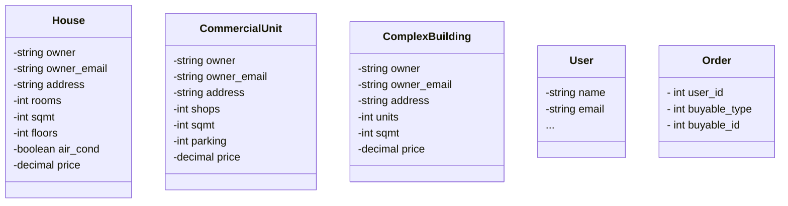

# RealHouse

A real estate purchasing platform at your service.

## Admin Section
It has a separate admin panel to manage properties. Visit `/admin` to access the portal. 

## Class Diagrams



## Things You Need To Know

* Ruby version: 3.2.0-preview1

* System dependencies
  - **Redis**
    - ```brew install redis``` 
  - **Sidekiq**
  - **ImageMagic, Vips**
    - ```brew install imagemagick vips```
  - **Administrate** for admin-panel

* Database creation
    ```bash
    rails db:create db:migrate db:seed
    ```

* How to run the test suite
    ```bash
    rspec spec/
    ```

* Services (job queues, cache servers, search engines, etc.)
  - redis
  - sidekiq
    - ```bundle exec sidekiq```
