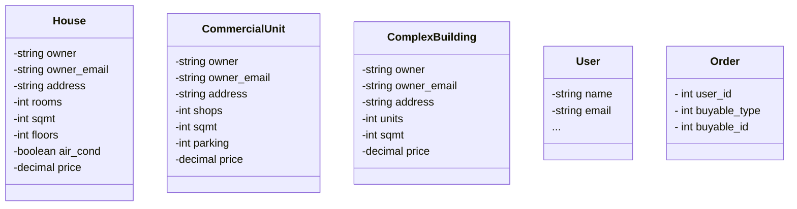
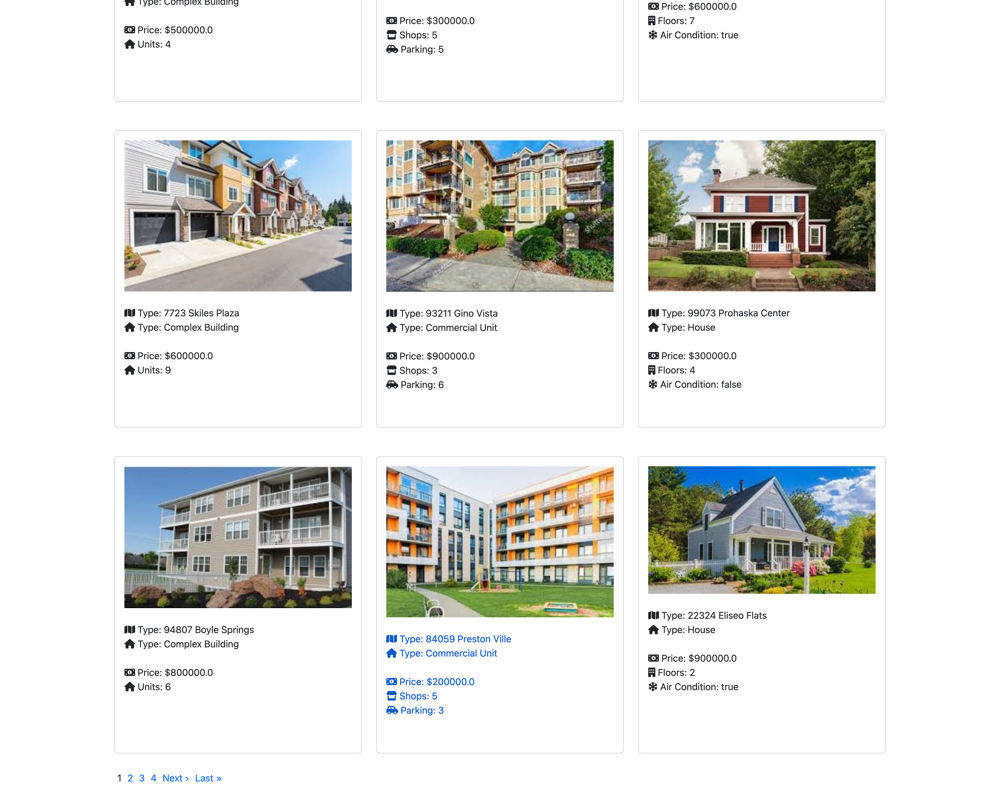

# RealHouse

A real estate purchasing platform at your service.

## Project setup Guideline
```
# Clone code
git clone git@github.com:shivabhusal/realestate.git

# bundle gems
bundle install

# Install dependencies
brew install redis imagemagick vips

# Create workable data for development
rails db:create db:migrate db:seed

# run rails server
rails s
```

You can open http://localhost:3000/admin/sidekiq for sidekiq dashboard 

## Admin Section
It has a separate admin panel to manage properties. Visit `/admin` to access the portal. 

## Class Diagrams



## Key Concept
- I have used DB View to merge 3 tables in one to get all assets into one list. [see this for more info](/db/migrate/20220727233954_create_properties.rb)

## Other Things You Need To Know

* Ruby version: 3.2.0-preview1

* System dependencies
  - **Redis**
    - ```brew install redis``` 
  - **Sidekiq**
  - **ImageMagic, Vips**
    - ```brew install imagemagick vips```
  - **Administrate** for admin-panel

* Database creation
    ```bash
    rails db:create db:migrate db:seed
    ```

* How to run the test suite
    ```bash
    rspec spec/
    ```

* Services (job queues, cache servers, search engines, etc.)
  - redis
  - sidekiq
    - ```bundle exec sidekiq```

## Screenshot

